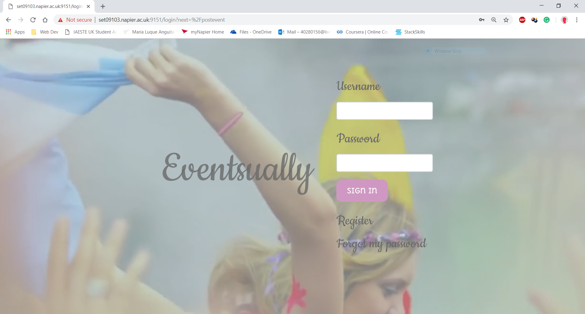
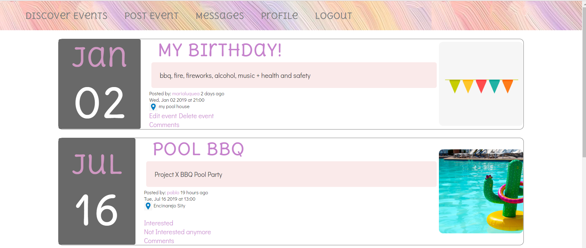
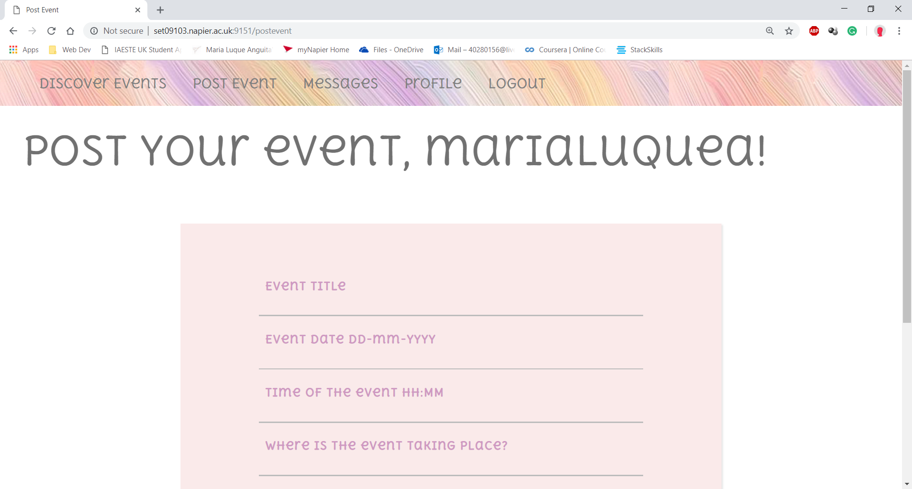
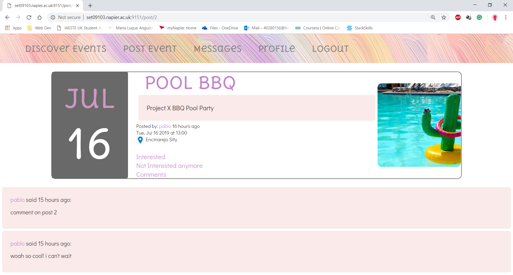
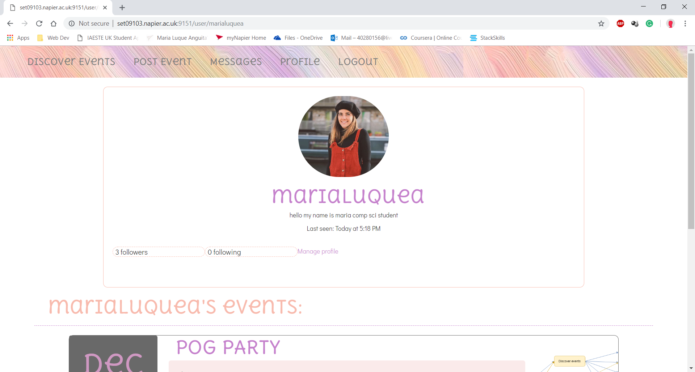
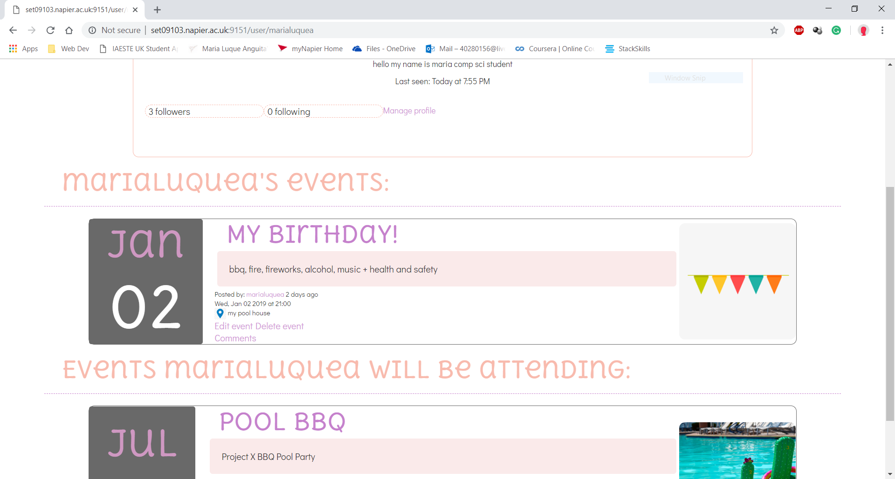
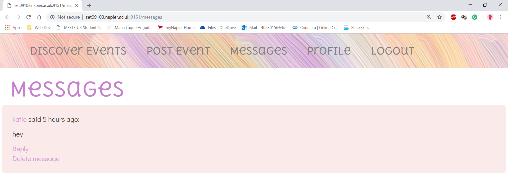
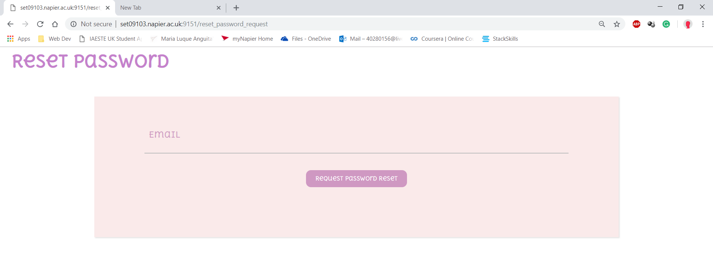

# Advanced Web Tech (set09103)

## Coursework 2

### Eventsually, a flask app used to find events near you and post your own

#### To run the program:

1. ``` $ cd ``` to the project folder

In PuTTY:
```
$ pip install flask

$ pip install flask-sqlalchemy

$ pip install flask-migrate

$ pip install flask-login

$ pip install flask-wtf

$ pip install flask-mail

$ pip install flask-moment

$ pip install flask_bootstrap

$ pip install PyJWT

$ pip install Pillow

$ export FLASK_ENV=development

$ export FLASK_APP=main.py

$ python -m flask run --host-0.0.0.0 --port 9151
```

Go in web browser to:

set09103.napier.ac.uk:9151

----------------------------------------------------------------------------------------------
----------------------------------------------------------------------------------------------

















Maria Luque Anguita

40280156
